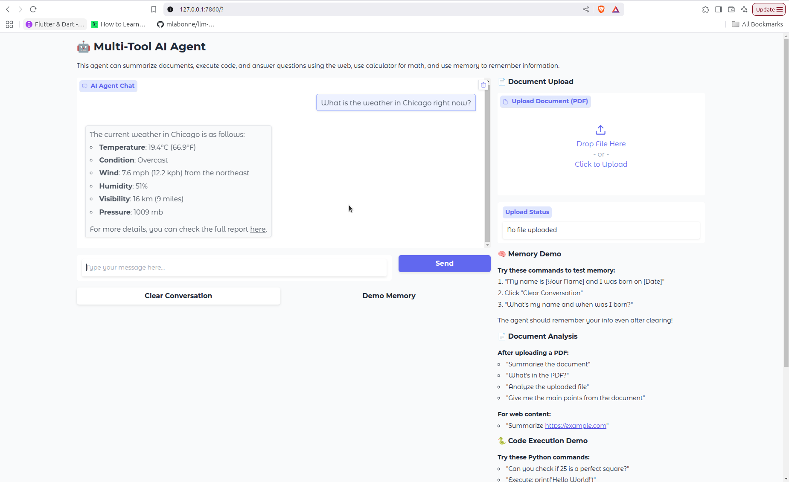

# MultiToolAgent - Intelligent Multi-Tool LLM Agent

A simple AI agent built with LangChain and LangGraph that can intelligently use multiple tools to solve complex tasks. The agent features web search, document summarization, Python code execution, mathematical calculations, and persistent memory - all accessible through an intuitive Gradio web interface.

## 🚀 Features

- **🧮 Calculator**: Perform mathematical computations with validation and error handling
- **🌐 Web Search**: Real-time information lookup using Tavily Search API with retry mechanisms
- **🐍 Python Code Execution**: Execute Python code snippets safely in a sandboxed environment
- **📄 Document Summarization**: Analyze and summarize PDFs and web URLs
- **🧠 Persistent Memory**: Remember information across conversation sessions
- **🔄 Error Handling**: Robust retry mechanisms and plan revision strategies

## 📋 Prerequisites

- Python 3.8 or higher
- OpenAI API key
- Tavily API key for web search functionality

## 🔧 Installation

### 1. Clone the Repository
```bash
git clone https://github.com/falco-tigris/Simple_Multi_Tool_Agent.git
cd Simple_Multi_Tool_Agent
```

### 2. Install Dependencies
```bash
pip install -r requirements.txt
```

### 3. Set Up Environment Variables
Create a `.env` file in the project root:
```bash
OPENAI_API_KEY=your_openai_api_key_here
TAVILY_API_KEY=your_tavily_api_key_here
```

**Getting API Keys:**
- **OpenAI API**: Get your key from [OpenAI Platform](https://platform.openai.com/api-keys)
- **Tavily API**: Sign up at [Tavily](https://tavily.com/) for web search capabilities

## 🏃‍♂️ Usage

### Running the Main Application
```bash
python MultiToolAgent.py
```

This launches the Gradio web interface, typically available at `http://localhost:7860`

### Generating Sample Interaction Logs
```bash
python generate_logs.py
```

This creates `detailed_interaction_logs.txt` with comprehensive examples of agent reasoning and tool usage.

### Running the Evaluation Suite
```bash
python evaluation_suite.py
```

Evaluates the agent's performance across different task categories with detailed metrics.

## 🎯 Sample Interactions

### Basic Calculator
```
User: "Calculate 15% tip on a $80 restaurant bill"
Agent: "A 15% tip on an $80 restaurant bill is $12.00."
```

### Python Code Execution
```
User: "Execute this Python code: print('Welcome to my AI agent!')"
Agent: "The output of the executed code is:
Welcome to my AI agent!"
```

### Web Search
```
User: "What's the current weather in Delhi?"
Agent: "The current weather in Delhi is:
- Temperature: 17.1°C (62.8°F)
- Condition: Sunny
- Humidity: 57%"
```

### Document Summarization
```
User: "Summarize this URL: https://harrypotter.fandom.com/wiki/Albus_Dumbledore"
Agent: "Albus Dumbledore was the headmaster of Hogwarts School of Witchcraft and Wizardry and one of the most powerful wizards in the Harry Potter series. He served as mentor to Harry Potter and played a crucial role in the fight against Lord Voldemort."
```

## 🖥️ Gradio Web Interface



*Screenshot showing the agent in action with a clean chat interface and sidebar features for document upload, memory demo, and code execution.*

## 📊 Project Files

- **MultiToolAgent.py** - Main agent implementation with Gradio UI and all tool integrations
- **generate_logs.py** - Creates detailed interaction logs showing agent reasoning and tool usage  
- **evaluation_suite.py** - Evaluates agent performance across different task categories
- **detailed_interaction_logs.txt** - Sample interaction examples with step-by-step reasoning
- **requirements.txt** - Python dependencies for the project

---

**Built with**: LangChain, LangGraph, OpenAI GPT-4, Gradio, and Tavily Search

